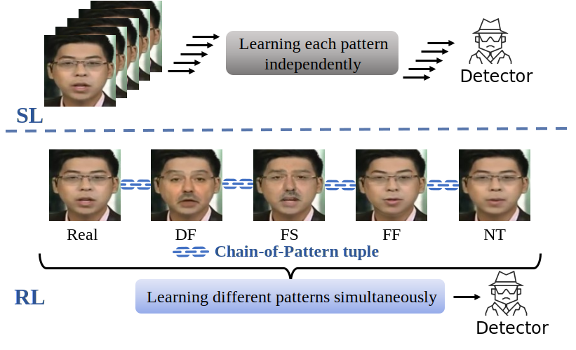

<h2 align="center">
Official Implementation of "Learning on the Image Sequence (LoIS) with Different Patterns for Face Forgery Detection"
</h2>

<center>
<div style="background-color: white; display: table;">
  
</div>
</center>

- CoP (Chain-of-Pattern) provides an image sequence that only differs in the forgery patterns, while keeping other contents unchanged, the detector could learn the relations between distinct forgery patterns and extract more general features.

<center>
<div style="background-color: white; display: table;">
  
</div>
</center>

- LoIS commences with a warm-up stage, which includes Supervised Learning (SL) in one epoch. This initial stage equips the detector with the ability to classify the real/fake face images to some extent. Next, the CoP sequence, which comprises the real face image and some fake face images generated from it, is adopted as the sequential data for Reinforcement Learning (RL).

## 🤖 Pre-trained Weights

In this link [[Baidu Disk](https://pan.baidu.com/s/1KTLQiA5fiOtJBDJ1_OmVww?pwd=9a7m#list/path=%2FLoIS%20Pre-trained)], we provide three versions of the pre-trained weights for LoIS:

1. `LoIS_ViT_L_14.pth` (~1GB): Trained from CLIP ViT-Large (PyTorch).
2. `LoIS_ViT_B_16.pth` (328MB): Trained from CLIP ViT-Base (PyTorch).
3. `RL_detector_b.mnn` (88MB): Int8 quantified model converted from `LoIS_ViT_B_16.pth` using the [MNN](https://github.com/alibaba/MNN/tree/master) (Mobile Neural Network) framework. This version is recommended for inference and experimenting with LoIS.

## 💪 Training

- The core code for the Supervised Learning (SL) and Reinforcement Learning (RL) stages of LoIS is located in the `train` folder.
    - `train_sl.py` implements the warm-up stage.
    - `train_cop.py` implements the Reinforcement Learning stage.
    - `test.py` runs the evaluation process on different datasets.
    - The Chain-of-Pattern sampling process is implemented in the `FFPP_ReFT_Dataset` class within `FFPP_Dataset.py`.

- For different datasets, you need to download and preprocess them according to their official websites and the instructions in the [Deepfake Benchmark](https://github.com/SCLBD/DeepfakeBench). Afterwards, update the corresponding file paths in `test_loader.py` (for other datasets) and `FFPP_ReFT_Dataset` (for FF++).

## 🔬 Inference

For a quick start (CPU only), follow these steps:

1. Create a virtual environment and install MNN:
    ```bash
    pip install MNN
    ```
2. Place the MNN model file in the current directory and specify the image file to be detected in `inference.py`. A pair of real/fake images are provided in the `imgs` folder for a quick test.
3. Run `inference.py`:
    ```bash
    python inference.py
    ```
4. Output interpretation:
    - Class `0` represents **Real**.
    - Class `1` represents **Fake**.
